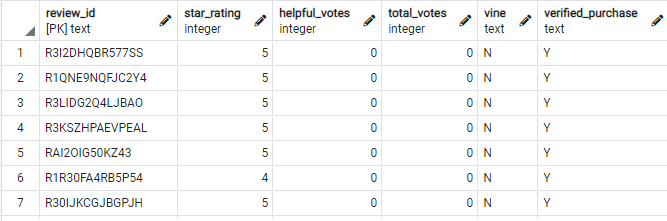
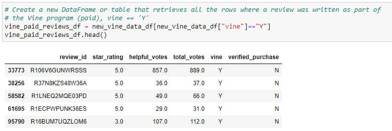
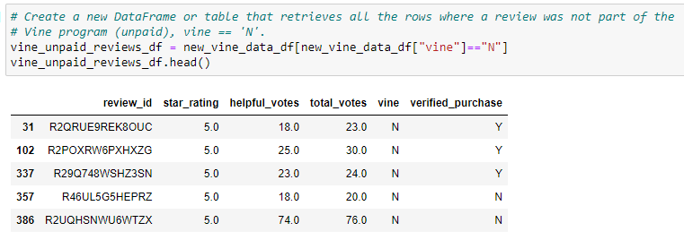
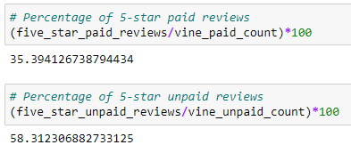

# Amazon Vine Analysis

## Overview

Working for the startup BigMarket, we are the first data expert on the team that focuses on helping businesses optimize their market efforts. Our next big project for our current client, SellBy, in sight is to analyze reviews written by members of the paid Amazon Vine program. This program is a service that allows its manufacturers and sellers to receive reviews of their products. For example, firms like SellBy will pay a fee to Amazon and send Amazon Vine members their own products, in which these individuals are then required to produce and publish a review. 

While Amazon Reviews has an abundant amount of review categories to choose from, for our analysis, we will be focusing on the billion dollar industry of Beauty products and its dataset. Utilizing tools such as PySpark, we will perform the ETL process to extract the dataset, transform the data, and connect the data to an AWS RDS instance, and then load the transformed dataset into pgAdmin. 

Afterwards, we will investigate if any bias exists toward favorable reviews from Vine members on the basis of whether they were paid or unpaid. This will aid in determining if having a paid Vine review will make a difference in the percentage of 5-star reviews. 

## Objectives: 
- Explain how MapReduce processes data.
- Define Spark and explain how it processes data.
- Describe how NLP collects and analyzes text data.
- Explain how to use AWS Simple Storage Service (S3) and relational databases for basic cloud storage.
- Complete an analysis of an Amazon customer review.

## Tools Used:
- AWS
- pgAdmin
- PySpark
- Google Colaboratory
- SQL
- Pandas
- Jupyter Notebook

## Dataset:
Amazon Beauty Review dataset: https://s3.amazonaws.com/amazon-reviews-pds/tsv/index.txt

## Analysis Insights
After having undergone the ETL process with the Amazon Beauty Reviews dataset, we take a look specifically at the vine table engineered through pgAdmin and exported as a csv via Excel to explore the all of the elements surrounding the vine reviews themselves. 

Initially, there are a total of 5,115,666 reviews to start off in our vine table. We are asked to filter the dataset based on two following criteria:
- Retrieve all rows where the total_votes count is equal to or greater than 20
- Retrieve all rows where the number of helpful_votes divided by the total_votes is equal to or greater than 50%

After filtering and creating a new dataset, there is a new total of 74,760 reviews. Using this new dataset, we look to answer the following research questions of Vine reviews that were paid versus unpaid. Below we can see two newly created dataframes, each filtered by the “vine” column. One dataframe contains all of the reviews that were written for the Vine program:

While the following dataframe contains all of the reviews that were not written for the Vine program:

From here we dive deeper into review analysis for each vine program category.

## Results
- **How many Vine reviews and non-Vine reviews were there?**

There were 647 Vine program reviews of beauty products. Comparing this to the total Vine reviews, this makes up roughly 0.87% of the total data

There were 74,113 reviews that were not part of the Vine program. The percentage of non-Vine reviews in comparison to the total Vine reviews is approximately 99.13%. The non-Vine program reviews by far exceeded the ones that were Vine program categorized reviews. 

- **How many Vine reviews were 5 stars? How many non-Vine reviews were 5 stars?** 

Utilizing the filtered dataset for vine paid reviews only, we determined that there were 229 reviews that were paid and given a ranking of 5-stars. 

However, for non-Vine reviews that were given 5-stars, we determined that there are 43,217 reviews in the whole data that received this type of rating. 

- **What percentage of Vine reviews were 5 stars? What percentage of non-Vine reviews were 5 stars?**

We determine that the overall percentage of Vine reviews that were compromised of 5-stars is approximately 35.39%. For the non-Vine reviews, we determine approximately 58.31%. 

Ultimately, we can see that the percentage of unpaid Vine reviews that ranked 5-stars exceeded the same measure for Vine reviews. There were more individuals of those who were not part of the Vine program but nonetheless provided greater high ranking reviews of 5-stars over Vine program participants. 

## Summary
After conducting our analysis of Amazon's beauty review data, we can conclude that bias does not exist for reviews in the Vine program. For members of the Vine program, they essentially have the job and responsibility of providing an accurate testament of the product they are publishing a review for. Granted they did publish less 5-star rating reviews than those who were not part of the program and therefore not paid, it should take into notice that they are more critical of their analysis in he reviews they do put out as part of their job. It can be seen as them being honest with giving a more true rating. This reasoning correlates with the lower percentage rating collected of 5-stars that Vine members gave versus the non-Vine members. 

For future analyses performed, it would be helpful to view another product category and perform the same analysis on that dataset. To see if the same trend and bias exists in other categories. Additionally, for the other product category compared to the beauty category, having zero filters exist in the dataset to solely obtain the information of the entire table would be beneficial to see how the entire 5.1 million figures compare completely. To get the overarching picture with all data included would be helpful to then gradually add filters to see if there is a level that triggers bias that we are not seeing or another statistical effect we cannot view with the filter established in this project analysis. 
